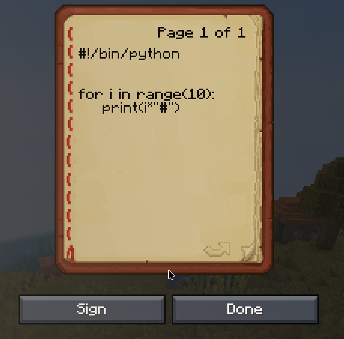
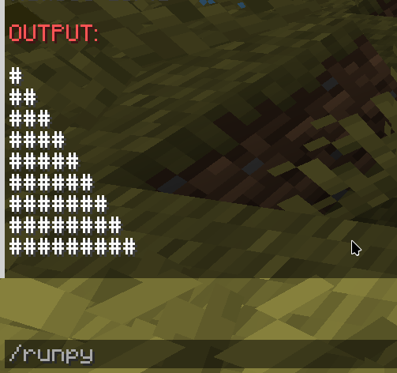

# Snekbox Minecraft Plugin

Run python code inside minecraft!

## Features

- allows you to write python code inside minecraft books and run the code inside the book you're holding with /runpy command
- safely run any arbitrary code with the help of snekbox inside safe nsjail sandboxes
- convinient docker config setup with geyser and via setup and devops script for plugin development

## Usage

1. Write python code inside a book in minecraft



2. hold the book and run the command `/runpy` in chat


3. See the output in chat



## Setup

### Automated

- run run-server.sh

- For development purposes, you can use build-and-update.sh to update plugin live on a server.

### Manual

- Add plugin .jar to your server's plugin directory
  building using

```sh
mvn clean
mvn package
```

- run a minecraft server with paper or spigot

to use the provided docker conf for minecraft server:

```sh
cd minecraft-server
sudo docker compose up mc
```

- Host a snekbox instance

to use the provided docker conf for snekbox:

```sh
cd minecraft-server
sudo docker compose up snekbox
```

- configure the snekbox URI in plugin config.yml
